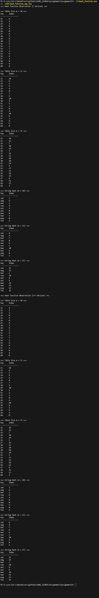
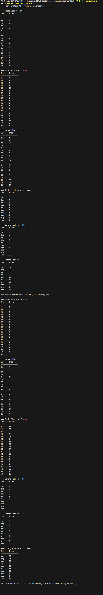

# Homework Assignment IV: Hash Function Design & Observation (C/C++ Version)

This assignment focuses on the design and observation of hash functions using C/C++. 
Students are expected to implement and analyze the behavior of hash functions, 
evaluate their efficiency, and understand their applications in computer science.

Developer: Miao-Xuan Xiao  
Email: s1113353@mail.yzu.edu.tw

## Development Environment
Windows 11, Visual Studio Code, Git and MinGW-w64 GCC/G++ 15.2.0

## My Hash Function
You can commit the code with each hash function uncommented individually and observe the differences in outputs. This helps illustrate how the choice of hash function and table size affects key distribution and collisions.
### Integer Keys 
- Three Methods: Division, Multiplication, Jenkins-like
- Formula / pseudocode:
  ```text
  // Division integer hash
  function divisionIntHash(key, m):
    return key modulo m
  ```
  - Rationale: Very simple, but sequential keys may produce repetitive patterns.  
<br><br>
  
  ```text
  // Multiplication integer hash
  function multiplicationIntHash(key, m):
    frac = (key * 0.618033) - floor(key * 0.618033)
    return floor(m * frac)
  ```
  - Rationale: Spreads keys more uniformly than simple division.  
<br><br>

  ```text
  //Jenkins-like integer hash
  function jenkinsIntHash(key, m):
    x = key
    x = x + (x shifted left by 11)
    x = x XOR (x shifted right by 13)
    x = x + (x shifted left by 6)
    x = x XOR (x shifted right by 10)
    x = x + (x shifted left by 15)
    return x modulo m
  ```
  - Rationale: Mixes bits thoroughly, reducing clustering and collisions.  
  <br><br>


### Non-integer Keys
- Three Methods: ASCII Sum, BKDR, SDBM
- Formula / pseudocode:
  ```text
  // ASCII sum string hash
  function asciiSumStringHash(str, m):
    hash = 0
    for each character c in str:
        hash += c
    return hash modulo m
  ```
  - Rationale: Simple sum, may produce collisions with similar strings(like dog and god).  
  <br><br>


  ```text
  // BKDR string hash
  function bkdrStringHash(str, m):
    hash = 0
    seed = 131
    for each character c in str:
        hash = hash * seed + c
    return hash modulo m
  ```
  - Rationale: Multiplies previous hash by seed, spreads values more evenly.  
  <br><br>

  ```text
  //SDBM string hash
  function sdbmStringHash(str, m):
      hash = 0
      for each character c in str:
          hash = c + (hash shifted left by 6) + (hash shifted left by 16) - hash
      return hash modulo m
  ```
  - Rationale: Bit mixing and shifts produce uniform distribution, good for reducing collisions.  
  <br><br>


## Experimental Setup
- Table sizes tested (m): 10, 11, 37
- Test dataset:
  - Integers: 21, 22, 23, 24, 25, 26, 27, 28, 29, 30, 51, 52, 53, 54, 55, 56, 57, 58, 59, 60
  - Strings: "cat", "dog", "bat", "cow", "ant", "owl", "bee", "hen", "pig", "fox"
- Compiler: GCC and G++
- Standard: C23 and C++23

## Results  

| Integer Hash Function      | Table Size (m) | Index Sequence                                              | Observation                                  |
| ------------------ | -------------- | ----------------------------------------------------------- | -------------------------------------------- |
| **division**       | **10**         | 1,2,3,4,5,6,7,8,9,0,1,2,3,4,5,6,7,8,9,0                     | Repeats every 10; predictable pattern        |
|                    | **11**         | 10,0,1,2,3,4,5,6,7,8,7,8,9,10,0,1,2,3,4,5                   | Some clustering at small values              |
|                    | **37**         | 21,22,23,24,25,26,27,28,29,30,14,15,16,17,18,19,20,21,22,23 | Sequential pattern; minimal mixing           |
| **multiplication** | **10**         | 9,5,2,8,4,0,6,3,9,5,5,1,7,3,9,6,2,8,4,0                     | Better spread; some collisions               |
|                    | **11**         | 10,6,2,9,4,0,7,3,10,5,5,1,8,4,10,6,2,9,5,0                  | Good distribution; periodic but less obvious |
|                    | **37**         | 36,22,7,30,16,2,25,11,34,20,19,5,27,13,36,22,8,31,17,3      | Well-scattered across table                  |
| **Jenkins-like**   | **10**         | 9,4,7,5,2,3,0,8,1,6,4,0,5,4,3,5,0,1,4,6                     | Strong mixing; irregular pattern             |
|                    | **11**         | 4,0,7,3,10,6,2,9,5,1,5,1,8,4,0,7,3,10,6,2                   | Good mixing; limited clustering              |
|                    | **37**         | 18,29,24,6,28,1,10,28,23,34,7,20,3,1,7,6,27,33,28,12        | Highly mixed; best distribution              |

| String Hash Function | Table Size (m) | Index Sequence                      | Observation                             |
| -------------------- | -------------- | ----------------------------------- | --------------------------------------- |
| ASCII sum            | 10             | 2, 4, 1, 9, 3, 8, 0, 5, 0, 3        | Simple, but repeats for similar letters |
|                      | 11             | 4, 6, 3, 10, 4, 8, 3, 7, 1, 3       | Slightly better, still some collisions  |
|                      | 37             | 16, 18, 15, 33, 27, 5, 4, 19, 24, 0 | Spread improves with larger prime table |
| BKDR                 | 10             | 2, 4, 1, 9, 3, 8, 0, 5, 0, 3        | Similar to ASCII sum for small table    |
|                      | 11             | 8, 4, 7, 8, 4, 1, 10, 3, 0, 1       | Better distribution than ASCII sum      |
|                      | 37             | 31, 32, 1, 18, 9, 9, 29, 33, 13, 35 | Large prime table gives good spread     |
| SDBM                 | 10             | 4, 2, 9, 3, 1, 4, 0, 9, 8, 9        | More varied than ASCII sum and BKDR     |
|                      | 11             | 5, 9, 6, 4, 8, 7, 4, 7, 5, 2        | Better spread, fewer repeats            |
|                      | 37             | 32, 25, 35, 7, 12, 18, 12, 3, 1, 36 | Excellent distribution with prime m     |


## Compilation, Build, Execution, and Output

### Compilation
- The project uses a comprehensive Makefile that builds both C and C++ versions with proper flags:
  ```bash
  # Build both C and C++ versions
  make all
  
  # Build only C version
  make c
  
  # Build only C++ version
  make cxx
  ```

### Manual Compilation (if needed)
- Command for C:
  ```bash
  gcc -std=c23 -Wall -Wextra -Wpedantic -g -o C/hash_function C/main.c C/hash_fn.c
  ```
- Command for C++:
  ```bash
  g++ -std=c++23 -Wall -Wextra -Wpedantic -g -o CXX/hash_function_cpp CXX/main.cpp CXX/hash_fn.cpp
  ```

### Clean Build Files
- Remove all compiled files:
  ```bash
  make clean
  ```

### Execution
- Run the compiled binary:
  ```bash
  ./hash_function
  ```
  or
  ```bash
  ./hash_function_cpp
  ```

### Result Snapshot
- Example output :  
  - Division (integer) & ASCII Sum (string)   
       
  - Multiplication (integer) & BKDR (string)  
      
  - Jenkins-like (integer) & SDBM (string)  
       

- Observations(Integer): Outputs align with the analysis, showing better distribution with prime table sizes.Division hashing shows repeating patterns, multiplication is better, and Jenkins-like hashing spreads keys most evenly. Using a prime table with a strong hash function reduces collisions and improves key distribution.

- Observations(String): Outputs align with the analysis, showing better distribution with prime table sizes.ASCII sum shows repeating patterns for similar characters, BKDR improves distribution, and SDBM spreads keys most evenly. Using a prime table with a strong string hash function reduces collisions and improves overall key distribution.

## Analysis
- Prime vs non-prime `m`: Prime table sizes (like 11, 37) clearly reduce patterns and collisions compared with non-prime sizes (like 10).  
- Patterns or collisions: Non-prime table sizes tend to produce repetitive index sequences, resulting in more collisions, especially noticeable with simpler hash functions like division or ASCII sum. 
- Improvements: Using a prime table size along with a well-mixed hash function (e.g., Jenkins-like for integers, SDBM or BKDR for strings) improves distribution, randomness, and minimizes collisions.

## Reflection
1. Designing hash functions requires balancing simplicity and effectiveness to minimize collisions.
2. Table size significantly impacts the uniformity of the hash distribution, with prime sizes performing better.
3. The combination of a prime table size and a mixing hash function produces the most uniform index sequences for both integer and string keys.
4. For string keys, using a hash function that mixes the influence of each character (e.g., SDBM or BKDR) reduces collisions compared to simple ASCII summation.  
5. For integer keys, simple division or multiplication hashing can produce repeated indices under certain patterns; using a Jenkins-like mixing hash function distributes keys more uniformly, especially with prime table sizes.

## Reference
- https://stackoverflow.com/questions/7666509/hash-function-for-string  
- https://hackmd.io/@Zero871015/DSNote-20  
- https://gist.github.com/badboy/6267743
