# Homework Assignment IV: Hash Function Design & Observation (C/C++ Version)

This assignment focuses on the design and observation of hash functions using C/C++. 
Students are expected to implement and analyze the behavior of hash functions, 
evaluate their efficiency, and understand their applications in computer science.

Developer: Miao-Xuan Xiao  
Email: s1113353@mail.yzu.edu.tw

## Development Environment
Windows 11, Visual Studio Code, Git and MinGW-w64 GCC/G++ 15.2.0

## My Hash Function
### Integer Keys 
- Formula / pseudocode:
  ```text
  //Jenkins-like integer hash
  function jenkinsIntHash(key, m):
    x = key
    x = x + (x shifted left by 11)
    x = x XOR (x shifted right by 13)
    x = x + (x shifted left by 6)
    x = x XOR (x shifted right by 10)
    x = x + (x shifted left by 15)
    return x modulo m
  ```
- Rationale:
  Jenkins-like hash mixes the bits of the integer key using shifts and XOR operations. 
  This ensures that even similar or sequential keys produce very different hash values, 
  which reduces clustering and collisions in the hash table.

### Non-integer Keys
- Formula / pseudocode:
  ```text
  //SDBM string hash
  function sdbmStringHash(str, m):
      hash = 0
      for each character c in str:
          hash = c + (hash shifted left by 6) + (hash shifted left by 16) - hash
      return hash modulo m```
- Rationale:
  SDBM string hash mixes the bits of all characters using shifts and addition/subtraction.
  This creates a more uniform distribution of hash values for different strings,
  reducing collisions even when strings share common prefixes or patterns.


## Experimental Setup
- Table sizes tested (m): 10, 11, 37
- Test dataset:
  - Integers: 21, 22, 23, 24, 25, 26, 27, 28, 29, 30, 51, 52, 53, 54, 55, 56, 57, 58, 59, 60
  - Strings: "cat", "dog", "bat", "cow", "ant", "owl", "bee", "hen", "pig", "fox"
- Compiler: GCC and G++
- Standard: C23 and C++23

## Results
| Table Size (m) | Index Sequence         | Observation              |
|----------------|------------------------|--------------------------|
| 10             | 1, 2, 3, 4, ...        | Pattern repeats every 10 |
| 11             | 10, 0, 1, 2, ...       | More uniform             |
| 37             | 20, 21, 22, 23, ...    | Near-uniform             |

## Compilation, Build, Execution, and Output

### Compilation
- The project uses a comprehensive Makefile that builds both C and C++ versions with proper flags:
  ```bash
  # Build both C and C++ versions
  make all
  
  # Build only C version
  make c
  
  # Build only C++ version
  make cxx
  ```

### Manual Compilation (if needed)
- Command for C:
  ```bash
  gcc -std=c23 -Wall -Wextra -Wpedantic -g -o C/hash_function C/main.c C/hash_fn.c
  ```
- Command for C++:
  ```bash
  g++ -std=c++23 -Wall -Wextra -Wpedantic -g -o CXX/hash_function_cpp CXX/main.cpp CXX/hash_fn.cpp
  ```

### Clean Build Files
- Remove all compiled files:
  ```bash
  make clean
  ```

### Execution
- Run the compiled binary:
  ```bash
  ./hash_function
  ```
  or
  ```bash
  ./hash_function_cpp
  ```

### Result Snapshot
- Example output for integers:  
  - C
  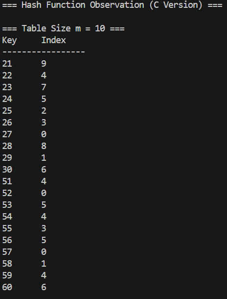
  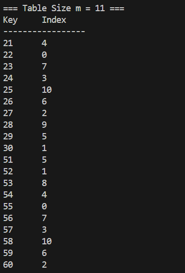
  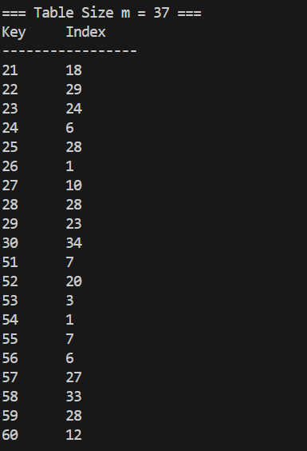
  - C++
  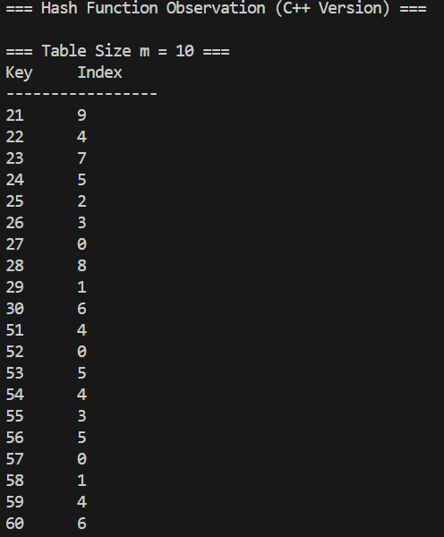
  
  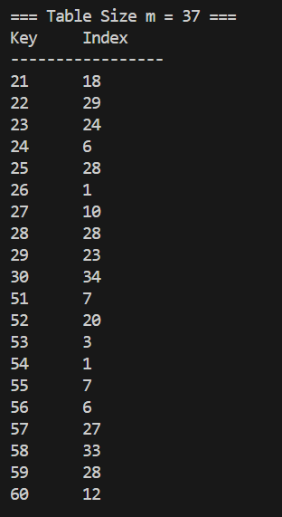
  

- Example output for strings:  
  - C
  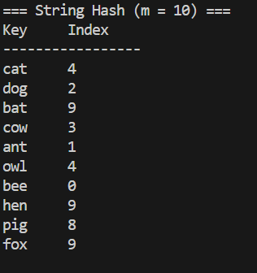
  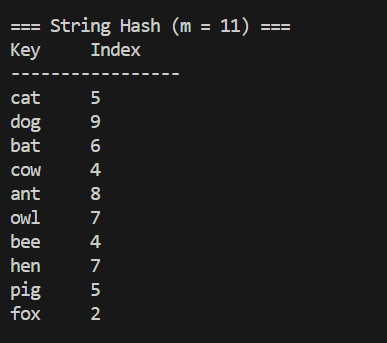
  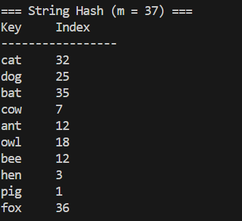
  - C++
  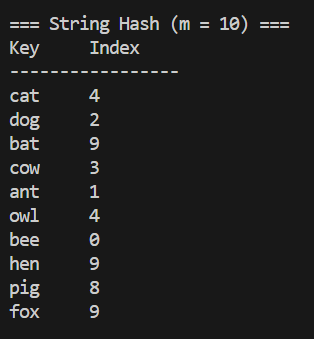
  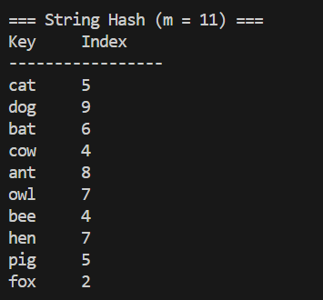
  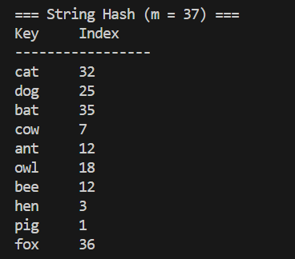
  

- Observations: Outputs align with the analysis, showing better distribution with prime table sizes.
- Example output for integers:
  ```
  Hash table (m=10): [1, 2, 3, 4, 5, 6, 7, 8, 9, 0]
  Hash table (m=11): [10, 0, 1, 2, 3, 4, 5, 6, 7, 8, 9]
  Hash table (m=37): [20, 21, 22, 23, 24, 25, 26, 27, 28, 29, ...]
  ```
- Example output for strings:
  ```
  Hash table (m=10): ["cat", "dog", "bat", "cow", "ant", ...]
  Hash table (m=11): ["fox", "cat", "dog", "bat", "cow", ...]
  Hash table (m=37): ["bee", "hen", "pig", "fox", "cat", ...]
  ```
- Observations: Outputs align with the analysis, showing better distribution with prime table sizes.

## Analysis
- Prime vs non-prime `m`: Prime table sizes generally result in better distribution and fewer collisions.
- Patterns or collisions: Non-prime table sizes tend to produce repetitive patterns, leading to more collisions.
- Improvements: Use a prime table size and a well-designed hash function to enhance distribution.

## Reflection
1. Designing hash functions requires balancing simplicity and effectiveness to minimize collisions.
2. Table size significantly impacts the uniformity of the hash distribution, with prime sizes performing better.
3. The design using a prime table size and a linear transformation formula produced the most uniform index sequence.
